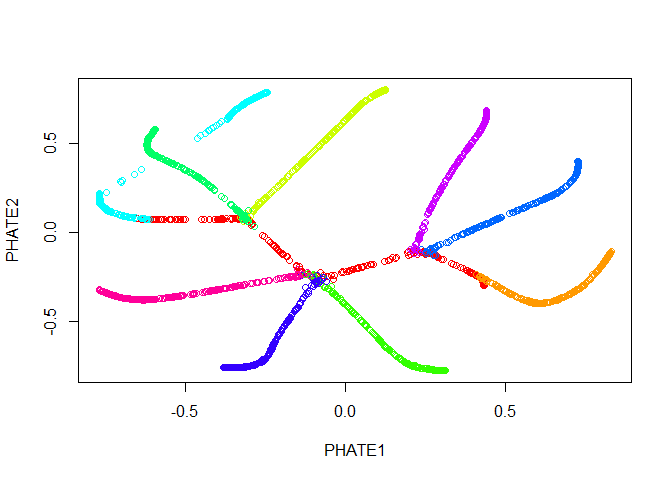
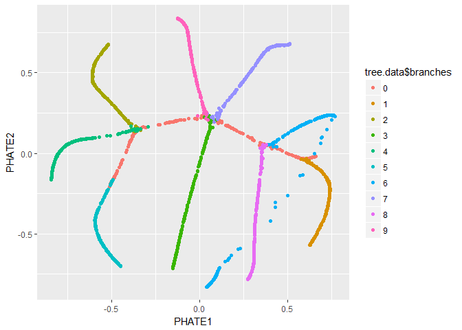

<!-- README.md is generated from README.Rmd. Please edit that file -->

# phater

This R package provides an implementation of the [PHATE dimensionality
reduction and visualization
method](https://www.biorxiv.org/content/early/2017/12/01/120378).

For a thorough overview of the PHATE visualization method, please see
the [bioRxiv
preprint](https://www.biorxiv.org/content/early/2017/12/01/120378)

For our Python and Matlab implementations, please see
[KrishnaswamyLab/PHATE](https://github.com/KrishnaswamyLab/PHATE).

## Installation

#### Installation with `devtools`

The R version of PHATE can be installed directly from R with `devtools`:

``` r
if (!suppressWarnings(require(devtools))) install.packages("devtools")
devtools::install_github("KrishnaswamyLab/phater")
```

#### Installation from source

1.  The R version of PHATE can be accessed
    [here](https://github.com/KrishnaswamyLab/phater), or by using:

<!-- end list -->

``` bash
git clone --recursive git://github.com/SmitaKrishnaswamy/PHATE.git
cd PHATE/phater
R CMD INSTALL
```

2.  If the `phater` folder is empty, you have may forgotten to use the
    `--recursive` option for `git clone`. You can rectify this by using:

<!-- end list -->

``` bash
$ cd PHATE
$ git submodule init
$ git submodule update
$ cd phater
$ R CMD INSTALL
```

## Tutorial

This is a basic example running `phate` on a highly branched example
dataset that is included with the package. First, let’s examine it with
PCA.

``` r
library(phater)
#> Loading required package: ggplot2
data(tree.data)
plot(prcomp(tree.data$data)$x, col=tree.data$branches)
```


Now we run PHATE on the data. We’ll just go ahead and try with the
default parameters.

``` r
# runs phate
tree.phate <- phate(tree.data$data)
#> Calculating kernel...
#> Calculated kernel in 2.4 secs.
#> Calculating diffusion operator...
#> Calculated diffusion operator in 7.1 secs.
#> Calculating diffusion potential...
#> Calculated diffusion potential in 7.2 secs.
#> Embedding metric MDS...
#> Calculated MDS in 38.3 secs.
#> Embedded PHATE in 55 secs.
summary(tree.phate)
#> PHATE embedding
#> k = 5, alpha = NA, t = 13
#> Data: (3000, 100)
#> Embedding: (3000, 2)
```

Let’s plot the results.

``` r
# plot embedding
palette(rainbow(10))
plot(tree.phate, col = tree.data$branches)
```


Good news\! Our branches look nice. However, all of the interesting
activity seems to be concentrated into one region of the plot - in this
case we should try the square root potential instead. We can also try
increasing `t` to make the structure a little clearer - in this case,
because synthetic data in unusually structured, we can use a very large
value, like 120, but in biological data the automatic `t` selection is
generally very close to ideal. Note here that if we pass our previous
result in with the argument `init`, we won’t have to recompute the
diffusion operator.

``` r
# runs phate with different parameters
tree.phate <- phate(tree.data$data, potential.method='sqrt', t=90, init=tree.phate)
#> Using precomputed kernel...
#> Using precomputed diffusion operator...
#> Calculating diffusion potential...
#> Calculated diffusion potential in 6.8 secs.
#> Embedding metric MDS...
#> Calculated MDS in 43.3 secs.
#> Embedded PHATE in 50.1 secs.
# plot embedding
palette(rainbow(10))
plot(tree.phate, col = tree.data$branches)
```



We can also pass the PHATE object directly to `ggplot`, if it is
installed.

``` r
library(ggplot2)
ggplot(tree.phate, aes(x=PHATE1, y=PHATE2, color=tree.data$branches)) +
  geom_point()
```



## Issues

Please let us know of any issues at the [GitHub
repo](https://github.com/KrishnaswamyLab/PHATE/issues)
