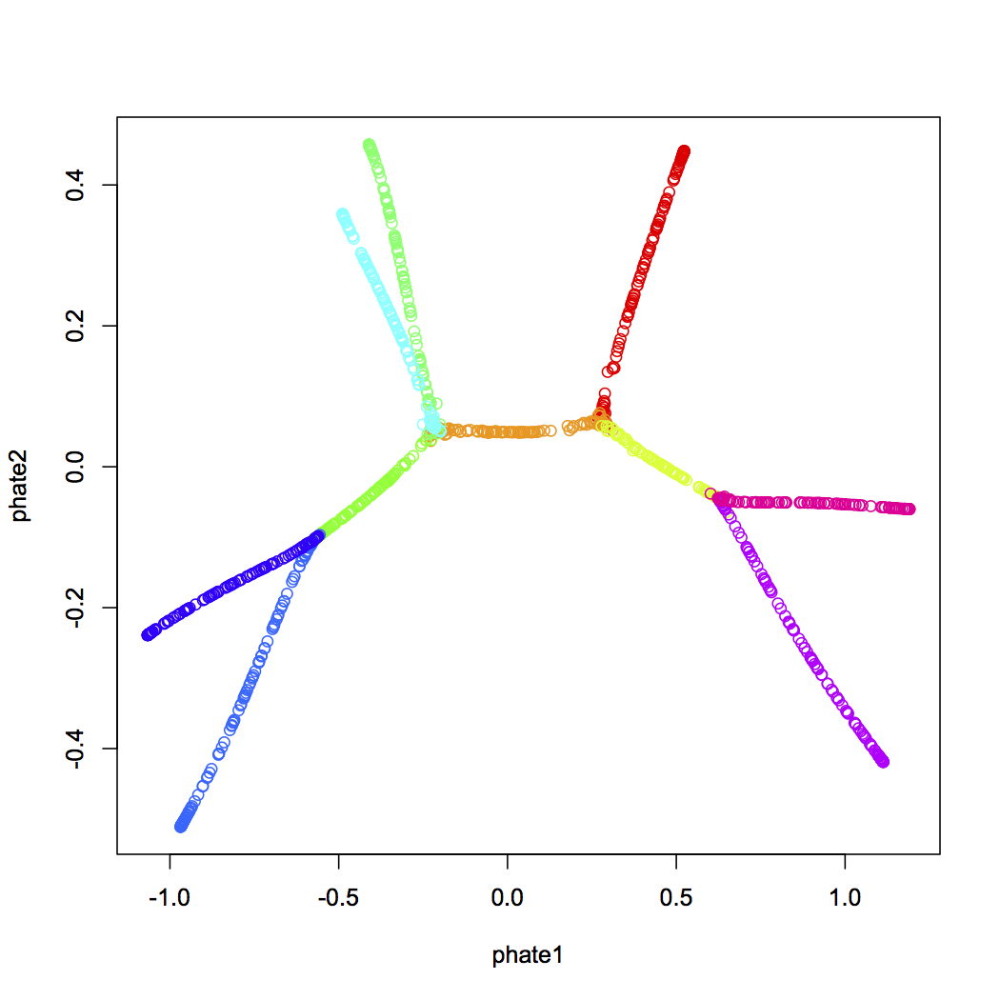

# phater

This R package provides an implementation of the
[PHATE dimensionality reduction and visualization method](https://www.biorxiv.org/content/early/2017/12/01/120378).

For a thorough overview of the PHATE visualization method, please see the [bioRxiv preprint](https://www.biorxiv.org/content/early/2017/12/01/120378)

For our Python and Matlab implementations, please see [KrishnaswamyLab/PHATE](https://github.com/KrishnaswamyLab/PHATE).

## Usage

```r
tree.data <- read.csv("data/TreeData.csv")
tree.branches <- tree.data[,61]
tree.data <- tree.data[,1:60]

# runs phate
tree.phate <- phate(tree.data, 375, 15, 20, pca.method='none', mds.method = 'mmds')
# plot embedding
palette(rainbow(10))
plot(tree.phate$embedding[,1], tree.phate$embedding[,2], col = tree.branches, xlab="phate1", ylab="phate2")
```



## Issues

Please let us know of any issues at the [GitHub repo](https://github.com/KrishnaswamyLab/phater/issues)
